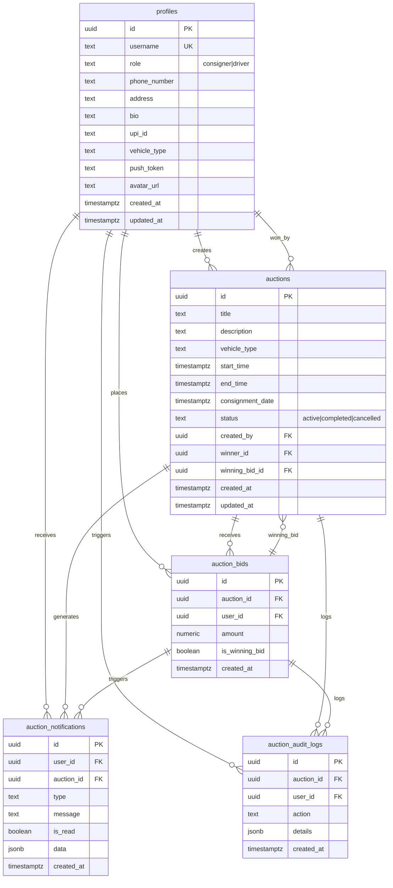

# Database Schema Diagram

## Entity Relationship Diagram



## Database Views

### active_auctions_summary

```sql
SELECT
    auctions.*,
    profiles.username as creator_username,
    profiles.phone_number as creator_phone,
    COUNT(auction_bids.id) as total_bids,
    MIN(auction_bids.amount) as current_highest_bid
FROM auctions
LEFT JOIN profiles ON auctions.created_by = profiles.id
LEFT JOIN auction_bids ON auctions.id = auction_bids.auction_id
WHERE auctions.status = 'active' AND auctions.end_time > now()
GROUP BY auctions.id, profiles.id
```

### user_notifications_summary

```sql
SELECT
    user_id,
    COUNT(*) as total_notifications,
    COUNT(*) FILTER (WHERE is_read = false) as unread_count,
    COUNT(*) FILTER (WHERE type = 'auction_won') as auctions_won,
    COUNT(*) FILTER (WHERE type = 'outbid') as times_outbid,
    MAX(created_at) as latest_notification
FROM auction_notifications
GROUP BY user_id
```

## Key Relationships

### 1. User Management

- `auth.users` (Supabase Auth) → `profiles` (Application Data)
- One-to-one relationship with CASCADE delete
- Profiles extend auth users with business logic

### 2. Auction Lifecycle

- `profiles` (consigner) → `auctions` (creates)
- `auctions` → `auction_bids` (receives)
- `auction_bids` → `auctions` (winning_bid_id)
- `profiles` (driver) → `auctions` (winner_id)

### 3. Notification Flow

- `auctions` → `auction_notifications` (auction events)
- `auction_bids` → `auction_notifications` (bidding events)
- `profiles` → `auction_notifications` (user-specific)

### 4. Audit Trail

- All major actions → `auction_audit_logs`
- Complete historical tracking
- JSON details for flexibility

## Data Flow Patterns

### Auction Creation Flow

```
Consigner → create_auction_optimized() → auctions table → log_auction_activity() → notifications
```

### Bidding Flow

```
Driver → create_bid_optimized() → auction_bids table → update winning_bid → notifications → audit_logs
```

### Auction Completion Flow

```
System/Manual → close_auction_optimized() → update auction status → determine winner → notifications
```

## Indexes & Performance

### Critical Indexes

- `idx_auctions_status` - Auction filtering
- `idx_auctions_end_time` - Expiration checks
- `idx_auction_bids_auction_id` - Bid queries
- `idx_auction_notifications_user_id` - User notifications
- `idx_profiles_role` - Role-based queries

### Query Optimization

- Views for complex joins
- Conditional indexes for filtered queries
- Function-based data access
- RLS policies for security

## Security Model

### Row Level Security (RLS)

```
profiles: Users see all, edit own
auctions: Role-based visibility (consigner/driver)
auction_bids: Based on auction accessibility
notifications: User-specific only
audit_logs: Limited to relevant records
```

### Access Patterns

- **Consigners**: Create auctions, view own auctions, receive notifications
- **Drivers**: View active auctions, place bids, receive notifications
- **System**: Create notifications, log activities, run maintenance

## Data Types & Constraints

### Vehicle Types

```sql
CHECK (vehicle_type IN (
    'three_wheeler',
    'pickup_truck',
    'mini_truck',
    'medium_truck',
    'large_truck'
))
```

### Notification Types

```sql
CHECK (type IN (
    'auction_created',
    'bid_placed',
    'outbid',
    'auction_won',
    'auction_lost',
    'auction_cancelled',
    'bid_cancelled'
))
```

### Status Types

```sql
CHECK (status IN (
    'active',
    'completed',
    'cancelled'
))
```

### Business Rules

- Auction duration: 5 minutes to 7 days
- Positive bid amounts only
- Unique bids per user per auction per amount
- Phone numbers: 10 digits
- UPI IDs: Valid format validation
